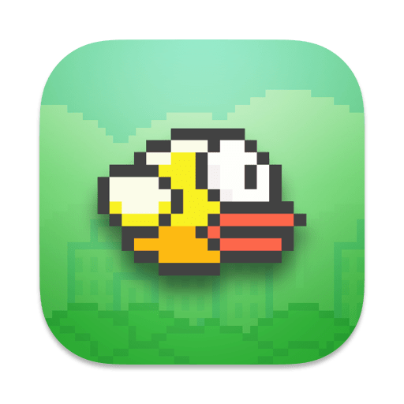

  
  <h1 align="center">Flappy Bird (with SpriteKit)</h1>

![SpriteKit](https://img.shields.io/badge/SpriteKit-black?logo=data:image/png;base64,iVBORw0KGgoAAAANSUhEUgAAAA4AAAAOCAYAAAAfSC3RAAAAAXNSR0IArs4c6QAAAERlWElmTU0AKgAAAAgAAYdpAAQAAAABAAAAGgAAAAAAA6ABAAMAAAABAAEAAKACAAQAAAABAAAADqADAAQAAAABAAAADgAAAAC98Dn6AAACd0lEQVQoFV2NS08TYRSG33am09JCWygXMaJiFUk0caNbQI1h4WVhQsJCIyzUn2BigkGiS287bwGMiRe6JDHxFnVhBCUEjBIFJSUt0E7b6bRDO53r8RuiJPgmbzLnzPOcD/gvRORlPcP62Sb6ohOddXb/YZtHkqQQg+6QbTOepVIhW1FUMozbElFoM/13IlHck9D1B+NZkaakLGkpkUrDw1S8fpWMty+dM/fZneiGzBZu1kPs+od5Mqj74xu6PPWJck+GKX20k5b276aVU0eIdPa6Te8Ye9Bx3OxCNetjeL0d4aSJS1YDLoaeo7r5Lri2X/C02aATx/BsdQVxrdy1zjKHZx+8aZmtPMcjM2uiNPEakZMvwAdVBLp9CCgBaPtqoVouqBUVZYt2mZbF83NzSUTCXrOuISxEu/xo2dsITz4AUya43QLgCyLgCaK3ZRtKShEzM9/N5ZU8+EQsATnqh9VlI1wfRE20F/aSCbM0DuI58NuPw9V+Gtl0Ggs/f2NxMgklo4JPFooQZoqcpujY0dGIptZ6VO3sh8DqxLBsJJMJfJv+gaVpEal4hitrLvB5zqV5y8UJbtHdWVnTYRy2sKUtAo9XgFbRmLSM+a9xxKdSkFMK5EJhssqoYSrLjf6nLVwVP+B1c+e3NkTQ2F4LX7MbopRBYj6FTLyA1LIITdMearY6NPLqZmJddORbfSNh+PwXBI6/Vh8Mefw1PNJrGSRXVyHlZEM1KgOGKtwbfT8oO/yG6AyDPWNCqM7u4wXPkMu0mkQ5BUnJpg1LvyJV+0ZjsUHd4ZxsEp3FWM8YF2+0D7gM/VxOzkBSc4/yvoXZWCxmOf//5Q9/5lu+JZPZ4QAAAABJRU5ErkJggg==)

A SpriteKit rewrite of the world-famous Flappy Bird.

### Comments
* The project uses a "GameObject" protocol that allows SKScene to forward some of its callbacks to conforming children.
Ex. `SKScene.update()` calls `update()` on all of its children.

* While the gameplay works great, there's an occasional bug with audio. `SKAction.playSoundFileNamed(_:waitForCompletion:)` was designed for simple sound effects. Sadly in practice I got unreliable results. Apparently other developers have been encountering this issue for years. A real project might use SKAudioNode or AVPlayer.

* I don't have every asset from the original game. So no pause button or fancy medals after a game over.

### Changes I would make for a bigger game
* In a larger project I might have made GameObject a word-for-word copy of all SKScene callbacks. Here, it only has 3 functions - `setUp()`, `update()` and `changeState(to:)`.

* Because this game really only takes place in one scene, I ended up using a GameState enum to keep track of which nodes are visible. I'm not a fan of the enum.
Each of the states in a real project (menu, playing, game over, settings, etc) would be their own SKScenes and instead of updating an enum case, I would be transitioning to a new SKScene altogether.
Breaking them into separate SKScenes would mean fewer nodes to keep track of and no "state" logic making sure the right things are hidden.

### Previews

  
   

### Disclaimer
This application was written for educational purposes under Fair Use. I don't own Flappy Bird or any of its art and audio assets.
